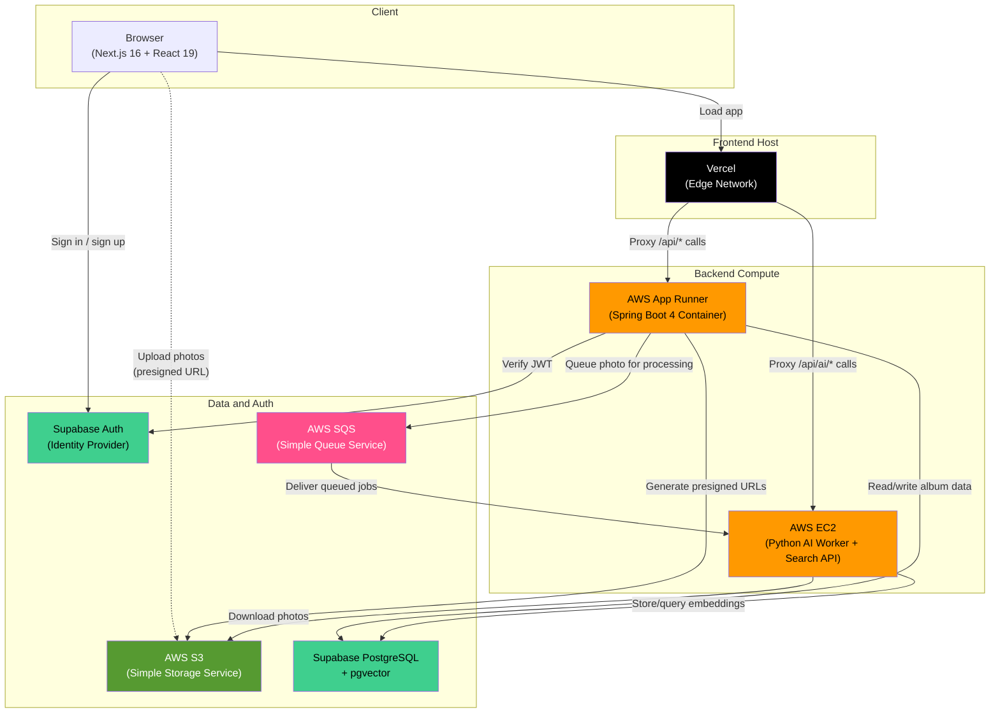
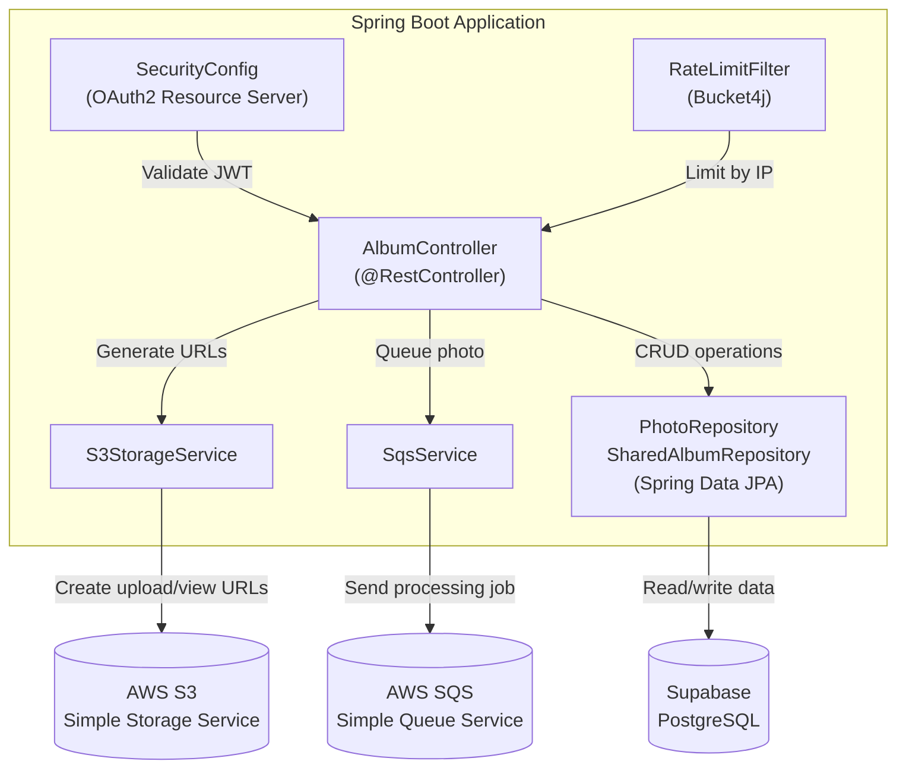
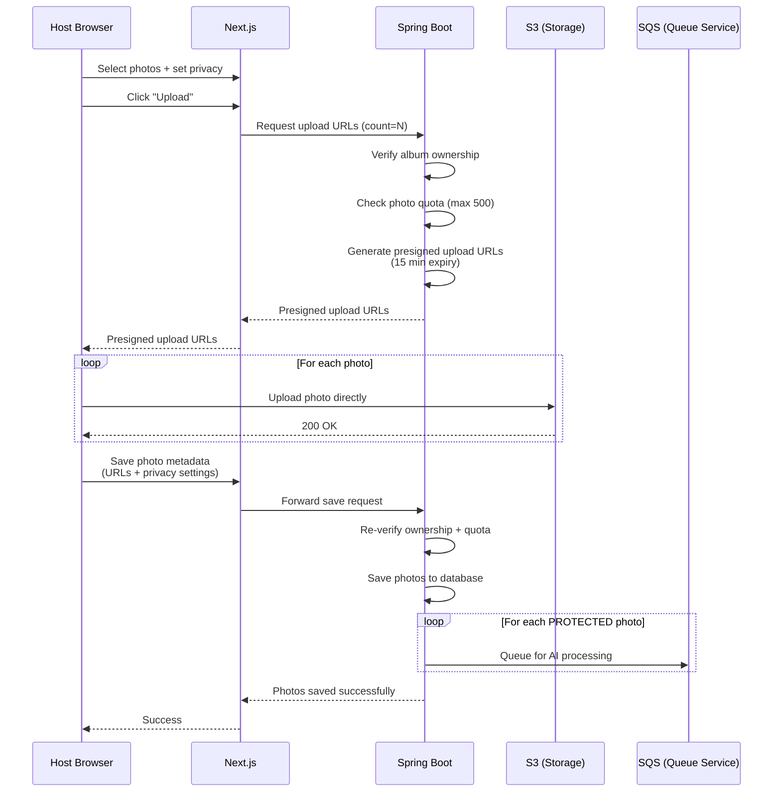
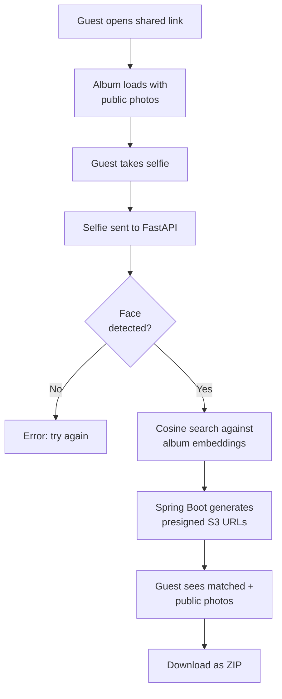
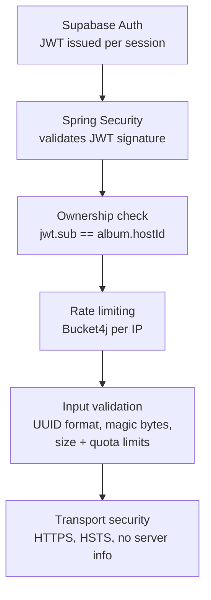
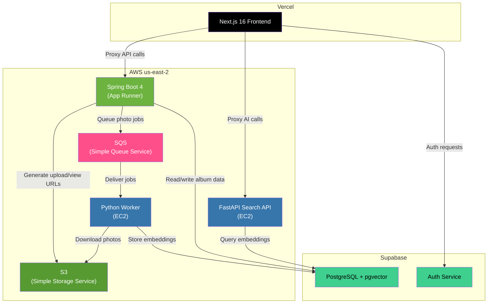

<p align="center">
  
  
  
  
  
  
  
  
  
  
  
  
  
  
  
  
  
</p>

<h1 align="center">GrabPic</h1>

<p align="center">
  <strong>AI-powered event photo sharing with facial recognition.</strong><br/>
  Upload event photos. Share one link. Guests take a selfie and instantly find every photo they appear in.
</p>

<p align="center">
  <a href="https://grab-pic.vercel.app/">Live App</a>
</p>

<br/>

<!-- VIDEO / DEMO -->
<p align="center">
  <em>[ Video demo placeholder ]</em>
</p>

<br/>

<!-- SCREENSHOT -->
<p align="center">
  <em>[ App screenshot placeholder ]</em>
</p>

---

## Table of Contents

1. [What is GrabPic](#what-is-grabpic)
2. [How It Works](#how-it-works)
3. [System Architecture](#system-architecture)
4. [Tech Stack Breakdown](#tech-stack-breakdown)
5. [Microservice Deep Dive](#microservice-deep-dive)
   - [Frontend (Next.js)](#1-frontend--nextjs-16)
   - [Backend API (Spring Boot)](#2-backend-api--spring-boot-40)
   - [AI Face Worker (Python)](#3-ai-face-worker--python)
   - [AI Search API (Python FastAPI)](#4-ai-search-api--python-fastapi)
6. [Database Schema](#database-schema)
7. [Authentication Flow](#authentication-flow)
8. [Photo Upload Pipeline](#photo-upload-pipeline)
9. [Face Detection Pipeline](#face-detection-pipeline)
10. [Guest Search Flow](#guest-search-flow)
11. [API Reference](#api-reference)
12. [Security Model](#security-model)
13. [Infrastructure and Deployment](#infrastructure-and-deployment)
14. [Project Structure](#project-structure)
15. [Local Development Setup](#local-development-setup)
16. [Environment Variables](#environment-variables)
17. [Use Cases](#use-cases)

---

## What is GrabPic

GrabPic solves a real problem that happens at every event: hundreds of photos get taken, and then everyone spends the next week texting each other asking "can you send me the ones I'm in?"

GrabPic lets an event host upload all their photos into an album, then share a single link with every guest. When a guest opens that link, they take a quick selfie. The system runs that selfie through a facial recognition pipeline, compares it against every face in the album, and returns only the photos that guest appears in. No accounts required for guests. No manual tagging. No scrolling through 400 photos to find yourself.

Every photo defaults to "protected" mode, meaning it is only visible to people whose face matches a face in that photo. The host can also mark specific photos as "public" so anyone with the album link can see them. Guests can download their matched photos as a zip file directly from the browser.

Free for up to 500 photos per album. No watermarks.

---

## How It Works

#### Host uploads photos


#### Guest finds their photos


The three-step process from the user's perspective:

**Step 1: Upload.** The host creates an album, selects photos, and marks each one as "public" (anyone with the link sees it) or "protected" (only people whose face is in the photo can see it). Protected is the default. Photos go straight to cloud storage, and the protected ones get queued for AI processing automatically.

**Step 2: AI scans every face.** A background worker picks up each protected photo, detects every face in it, and stores a mathematical fingerprint (a 512-dimensional vector) for each face in the database. No manual tagging needed.

**Step 3: Guests take a selfie.** The host shares one link. A guest opens it, takes a selfie right in the browser, and hits "Find My Photos." The system compares the guest's face against every face in the album and returns only the photos they appear in. They can download their matches as a zip file on the spot.

---

## System Architecture



The system is composed of three independently deployed services that communicate through AWS SQS (async job processing) and shared access to a PostgreSQL database (Supabase) and S3 bucket. The frontend proxies all API calls through Next.js rewrites so the browser never talks directly to backend services, which keeps API URLs hidden and avoids CORS complexity.

---

## Tech Stack Breakdown

### Frontend

| Technology       | Version | Purpose                                                           |
| ---------------- | ------- | ----------------------------------------------------------------- |
| Next.js          | 16.1.6  | React framework with SSR, file-based routing, API route proxying  |
| React            | 19.2.3  | UI rendering                                                      |
| TypeScript       | 5.x     | Type safety                                                       |
| Tailwind CSS     | 4.x     | Utility-first styling with dark mode support                      |
| Supabase JS      | 2.97.0  | Client-side auth (OAuth, email/password), real-time subscriptions |
| JSZip            | 3.10.1  | Client-side zip generation for bulk photo downloads               |
| qrcode.react     | 4.2.0   | QR code generation for album sharing                              |
| Lucide React     | 0.575.0 | Icon library                                                      |
| Radix UI         | 1.4.3   | Accessible UI primitives                                          |
| Vercel Analytics | 1.6.1   | Usage tracking                                                    |

### Backend API

| Technology        | Version    | Purpose                                        |
| ----------------- | ---------- | ---------------------------------------------- |
| Spring Boot       | 4.0.3      | REST API framework                             |
| Java              | 21         | Language runtime (LTS)                         |
| Spring Security   | (via Boot) | OAuth2 Resource Server with JWT validation     |
| Spring Data JPA   | (via Boot) | ORM / repository layer                         |
| Hibernate         | (via JPA)  | Database mapping, DDL validation               |
| PostgreSQL Driver | (runtime)  | JDBC connectivity to Supabase Postgres         |
| AWS SDK S3        | 2.20.0     | Presigned URL generation for uploads and views |
| AWS SDK SQS       | 2.20.0     | Job queue messaging                            |
| Bucket4j          | 8.14.0     | Token-bucket rate limiting                     |
| Lombok            | (compile)  | Boilerplate reduction                          |
| Maven             | 3.9.6      | Build system                                   |

### AI Face Worker

| Technology   | Version        | Purpose                                           |
| ------------ | -------------- | ------------------------------------------------- |
| Python       | 3.x            | Language runtime                                  |
| DeepFace     | 0.0.98         | Face detection and embedding extraction           |
| GhostFaceNet | (via DeepFace) | Face recognition model producing 512-D embeddings |
| RetinaFace   | 0.0.17         | Face detection backend (high accuracy)            |
| TensorFlow   | 2.20.0         | Deep learning runtime for model inference         |
| FastAPI      | 0.132.0        | HTTP API for guest selfie search                  |
| Uvicorn      | 0.41.0         | ASGI server                                       |
| Boto3        | 1.42.55        | AWS S3 + SQS client                               |
| psycopg2     | 2.9.11         | Direct PostgreSQL connectivity                    |
| SlowAPI      | 0.1.9          | Rate limiting on search endpoint                  |
| OpenCV       | 4.13.0         | Image processing                                  |
| NumPy        | 2.2.6          | Numerical computation                             |
| Gunicorn     | 25.1.0         | Production WSGI server                            |

### Infrastructure

| Service               | Provider | Purpose                                             |
| --------------------- | -------- | --------------------------------------------------- |
| Vercel                | Vercel   | Frontend hosting with edge CDN                      |
| App Runner            | AWS      | Containerized Spring Boot deployment (auto-scaling) |
| EC2 (Ubuntu)          | AWS      | Persistent Python AI worker and FastAPI server      |
| ECR                   | AWS      | Docker container registry for Spring Boot image     |
| S3                    | AWS      | Object storage for event photos                     |
| SQS                   | AWS      | Message queue decoupling upload from AI processing  |
| PostgreSQL + pgvector | Supabase | Relational data + vector similarity search          |
| Supabase Auth         | Supabase | Authentication (Google, GitHub, email/password)     |

---

> **Everything below this point is the technical documentation.** It covers the internals of each microservice, database design, authentication, security hardening, and deployment infrastructure in full detail.

---

## Microservice Deep Dive

### 1. Frontend / Next.js 16

The frontend is a single-page application built with Next.js 16 App Router and React 19. It is deployed on Vercel and acts as the gateway for all user interactions. All API calls from the browser are routed through Next.js rewrites defined in `next.config.ts`, which means the browser never sees the raw backend URLs.


**Routing breakdown:**

| Route                         | Auth Required            | Description                                                                   |
| ----------------------------- | ------------------------ | ----------------------------------------------------------------------------- |
| `/`                           | No                       | Landing page with feature overview, how-it-works, and CTA                     |
| `/login`                      | No (redirects if authed) | Email/password + Google/GitHub OAuth login                                    |
| `/signup`                     | No (redirects if authed) | Account registration with email verification                                  |
| `/dashboard`                  | Yes                      | Album list, create new albums                                                 |
| `/dashboard/albums/[id]`      | Yes                      | Photo upload page with drag-and-drop, privacy toggles                         |
| `/dashboard/albums/[id]/view` | Yes                      | Album viewer with face detection overlay, share modal, QR code, bulk download |
| `/albums/[id]/guest`          | No                       | Public guest page with selfie camera, AI photo finder, zip download           |

**Auth guards.** `useRequireAuth()` checks the Supabase session and redirects unauthenticated users to `/login`. `useRedirectIfAuth()` on login/signup pages sends already-authenticated users to `/dashboard`.

**Download proxy.** `/api/download-proxy` fetches S3 images server-side to avoid CORS issues. It validates the target URL against an S3 domain pattern before proxying to prevent SSRF.

**Real-time updates.** When the AI worker marks a photo as `processed = true`, the album view page picks up the change through a Supabase Realtime subscription and refreshes automatically.

---

### 2. Backend API / Spring Boot 4.0

The Spring Boot service is the core REST API that handles album CRUD, photo metadata persistence, presigned URL generation for S3, and SQS message dispatch. It runs as a Docker container on AWS App Runner, pulled from AWS ECR.



**Security configuration** validates every incoming request (except guest endpoints) against Supabase's JWKS endpoint using ES256 signed JWTs. The `SecurityFilterChain` permits `/api/albums/*/guest/**` without authentication and requires a valid JWT for everything else. CORS is configured to only allow the frontend origin.

**Rate limiting** uses Bucket4j with three separate token buckets per client IP:

| Endpoint Pattern         | Limit       | Window   |
| ------------------------ | ----------- | -------- |
| `/guest/search-results`  | 5 requests  | 1 minute |
| `/guest/details`         | 20 requests | 1 minute |
| `/api/*` (authenticated) | 60 requests | 1 minute |

The `RateLimitFilter` also injects security headers on every response: `X-Content-Type-Options: nosniff`, `X-Frame-Options: DENY`, `X-XSS-Protection: 1; mode=block`, `Referrer-Policy: strict-origin-when-cross-origin`, and `Permissions-Policy: camera=(), microphone=(), geolocation=()`.

**S3 lifecycle management:** On startup, the `S3StorageService` applies a lifecycle rule to the S3 bucket that auto-aborts incomplete multipart uploads after 1 day. This prevents attackers from starting uploads and abandoning them to consume storage.

**Album quota enforcement** is applied at two layers (defense in depth): once when generating presigned upload URLs (`GET /{albumId}/upload-urls`) and again when saving photo metadata (`POST /{albumId}/photos`). The hard cap is 500 photos per album, with a maximum batch size of 50 presigned URLs per request.

---

### 3. AI Face Worker / Python

The AI worker is a long-running Python process deployed on an AWS EC2 Ubuntu instance. It runs in an infinite loop, long-polling the SQS queue for new photo processing jobs. This is the background workhorse that powers the face detection pipeline.


The worker uses SQS long polling with a 20-second wait time, which minimizes empty receives and reduces AWS costs. Messages are only deleted from the queue after successful processing, so if the worker crashes mid-processing, the message becomes visible again and gets retried. This gives the system at-least-once processing guarantees.

Before downloading and processing, the worker checks if the photo still exists in the database. If a host deleted a photo between the time it was queued and the time the worker picks it up, the worker skips it.

DeepFace is configured with:

- **Model:** GhostFaceNet (produces 512-dimensional face embeddings)
- **Detector:** RetinaFace (high accuracy, handles multiple faces per image)
- **enforce_detection:** `False` (so photos with no faces do not throw errors and are simply marked as processed with zero embeddings)

Each detected face produces a 512-float embedding vector and a bounding box (`facial_area`). The embedding is formatted as a pgvector-compatible string `[0.1,0.2,...]` and inserted into `photo_embeddings`. The bounding box is stored as a JSONB column for frontend rendering of face detection overlays.

---

### 4. AI Search API / Python FastAPI

Running on the same EC2 instance as the worker, the FastAPI service exposes a single `POST /search` endpoint that handles the guest selfie matching workflow. The Next.js frontend proxies `/api/ai/*` to this service.


**Input validation** runs before any AI processing:

1. Album ID must match a strict UUID regex
2. MIME type must be JPEG, PNG, or WebP
3. File size is capped at 5 MB
4. Magic bytes are checked to catch spoofed Content-Type headers

The selfie is written to a temp file for DeepFace and deleted in a `finally` block regardless of outcome. It is never stored.

**Cosine distance matching** uses pgvector's `<=>` operator with a threshold of 0.45, which balances precision and recall. Lower values miss matches when lighting or angles differ, higher values produce false positives. Results are capped at 50 per search.

**Rate limiting:** 5 requests per minute per IP via SlowAPI with proxy header extraction (`X-Forwarded-For`, `X-Real-IP`).

---

## Database Schema

The application uses Supabase PostgreSQL with the pgvector extension enabled for vector similarity search.


**`shared_albums`** stores album metadata. The `host_id` is the Supabase Auth user ID (extracted from the JWT `sub` claim). The `created_at` timestamp is set automatically via a `@PrePersist` JPA callback.

**`photos`** stores per-photo metadata. `storage_url` is the S3 object key (`albums/{albumId}/{uuid}.jpg`). `access_mode` controls visibility: `PUBLIC` (anyone sees it) or `PROTECTED` (only face-matched guests). `processed` tracks whether the AI worker has finished extracting embeddings.

**`photo_embeddings`** is the vector table. One row per detected face, so a group photo with three people produces three rows. `embedding` stores a 512-D vector via pgvector for cosine distance searches. `box_area` is JSONB with the bounding box coordinates (`x`, `y`, `w`, `h`) that the frontend uses to draw face detection overlays.

Cascade delete is configured at the JPA level: deleting an album cascades to its photos, and deleting a photo cascades to its embeddings (`CascadeType.ALL` + `orphanRemoval = true`).

---

## Authentication Flow


Supabase Auth handles all authentication. Supported providers are Google, GitHub, and email/password. On the backend, Spring Security is configured as an OAuth2 Resource Server that fetches public keys from Supabase's JWKS endpoint and validates the ES256 signature on every incoming JWT. The user identity is extracted from `jwt.getSubject()` and used to scope all album queries to the authenticated user, preventing cross-user data access.

Guest endpoints (`/api/albums/*/guest/**`) are exempted from authentication via `.requestMatchers("/api/albums/*/guest/**").permitAll()` in the security filter chain.

---

## Photo Upload Pipeline



The upload flow uses a presigned URL pattern where the browser uploads directly to S3, bypassing the backend entirely for file transfer. Presigned PUT URLs expire after 15 minutes and are scoped to `content-type: image/jpeg`. The S3 key follows `albums/{albumId}/{randomUUID}.jpg`.

Only photos marked as `PROTECTED` are sent to SQS for AI processing. Public photos skip the queue because they are visible to everyone.

---

## Face Detection Pipeline


The DeepFace pipeline uses GhostFaceNet, which is a lightweight model that produces compact 512-dimensional embeddings while maintaining strong accuracy on standard face verification benchmarks. RetinaFace is used as the detection backend because it handles faces at various scales and angles well, including partially occluded faces in group photos.

The embedding vector is stored in PostgreSQL using the pgvector extension. pgvector supports exact nearest-neighbor search and approximate nearest-neighbor search via IVFFlat or HNSW indexes. The cosine distance operator (`<=>`) is used for searches, which measures the angular difference between two vectors regardless of magnitude.

---

## Guest Search Flow



**Selfie capture.** On mobile, the native camera input is triggered with `capture="user"`. On desktop, a `getUserMedia()` video stream lets the guest snap a photo that gets converted to a JPEG blob.

**After matching.** The guest browses public photos and their AI-matched photos. They can select individual photos or "Select All," then download as a ZIP generated client-side with JSZip. Downloads route through the Next.js server-side proxy to avoid CORS with S3. If no face is detected (`enforce_detection=True`), the API returns a clear error instead of zero matches.

---

## API Reference

### Authenticated Endpoints (JWT Required)

| Method   | Endpoint                                                         | Description                                        |
| -------- | ---------------------------------------------------------------- | -------------------------------------------------- |
| `POST`   | `/api/albums`                                                    | Create a new album                                 |
| `GET`    | `/api/albums`                                                    | List all albums owned by the authenticated user    |
| `DELETE` | `/api/albums/{albumId}`                                          | Delete an album and all its photos/embeddings      |
| `GET`    | `/api/albums/{albumId}/upload-urls?count=N`                      | Generate N presigned S3 PUT URLs (max 50)          |
| `POST`   | `/api/albums/{albumId}/photos`                                   | Save photo metadata after S3 upload + queue for AI |
| `GET`    | `/api/albums/{albumId}/photos`                                   | Get all photos in album with presigned view URLs   |
| `DELETE` | `/api/albums/{albumId}/photos/{photoId}`                         | Delete a single photo                              |
| `PUT`    | `/api/albums/{albumId}/photos/{photoId}/privacy?makePublic=bool` | Toggle photo privacy                               |

### Public Guest Endpoints (No Auth)

| Method | Endpoint                                     | Description                              |
| ------ | -------------------------------------------- | ---------------------------------------- |
| `GET`  | `/api/albums/{albumId}/guest/details`        | Get album title + public photos          |
| `POST` | `/api/albums/{albumId}/guest/search-results` | Get presigned URLs for matched photo IDs |

### AI Search Endpoint (EC2)

| Method | Endpoint  | Description                                       |
| ------ | --------- | ------------------------------------------------- |
| `POST` | `/search` | Send selfie + album_id, receive matched photo IDs |

---

## Security Model



**Authorization model:** Every authenticated endpoint extracts the user ID from the JWT `sub` claim and compares it to `album.hostId`. If they do not match, the request is rejected with HTTP 403. Guest endpoints are scoped to read-only operations on public data and face-matched data, and the search results endpoint validates that requested photo IDs actually belong to the specified album to prevent cross-album data access.

**Presigned URL security:** Upload URLs expire after 15 minutes and are restricted to `content-type: image/jpeg`. View URLs expire after 7 hours. Presigned URLs are generated per-request and are never stored in the database.

**Infrastructure security measures:**

- Stack traces, exception details, and binding errors are suppressed in API responses (`server.error.include-*=never/false`)
- Server header is blanked (`server.server-header=`)
- Connection pool is capped at 10 connections with 10-second timeout to prevent exhaustion
- Tomcat is limited to 100 threads with 10-second connection timeout
- Max request body size is 10 MB
- S3 lifecycle rule auto-aborts abandoned multipart uploads after 1 day
- Download proxy validates URLs against S3 domain pattern to prevent SSRF
- Guest selfies are never persisted to disk (temp file deleted in `finally` block)
- CORS is restricted to the frontend origin only

---

## Infrastructure and Deployment



### Frontend Deployment (Vercel)

Deployed on Vercel with automatic Git deploys, edge CDN, HTTPS, and serverless function support for the download proxy. Environment variables are configured in the Vercel dashboard.

Live URL: **https://grab-pic.vercel.app/**

### Backend Deployment (AWS App Runner + ECR)

Containerized via multi-stage Docker build: Maven + Temurin 21 for compilation, Temurin 21 JRE for the runtime image. Pushed to ECR and deployed on App Runner, which handles auto-scaling, HTTPS, and health checks.

```dockerfile
FROM maven:3.9.6-eclipse-temurin-21 AS build
COPY . .
RUN mvn clean package -DskipTests

FROM eclipse-temurin:21-jre
COPY --from=build /target/api-0.0.1-SNAPSHOT.jar app.jar
EXPOSE 8080
ENTRYPOINT ["java", "-jar", "app.jar"]
```

Live URL: **https://dwe6qje6cs.us-east-2.awsapprunner.com**

### AI Worker Deployment (AWS EC2)

Both the SQS worker (`main.py`) and the FastAPI search API (`api.py`, port 5000) run on a single EC2 Ubuntu instance. The worker polls SQS continuously, the API runs via Uvicorn.

EC2 instance: `ubuntu@18.218.106.22` (us-east-2)

TensorFlow and OpenCV dependencies make this better suited for a VM than serverless, given model sizes and persistent inference needs.

---

## Project Structure

```
grab-pic/
│
├── grab-pic-web/                    # Next.js 16 frontend
│   ├── app/                         # App Router pages
│   │   ├── page.tsx                 # Landing page
│   │   ├── layout.tsx               # Root layout (Navbar, fonts, analytics)
│   │   ├── not-found.tsx            # Custom 404 page
│   │   ├── globals.css              # Tailwind CSS base styles
│   │   ├── login/page.tsx           # Login (email + OAuth)
│   │   ├── signup/page.tsx          # Signup (email + OAuth)
│   │   ├── dashboard/
│   │   │   ├── page.tsx             # Album list + create
│   │   │   └── albums/[id]/
│   │   │       ├── page.tsx         # Photo upload with privacy toggles
│   │   │       └── view/page.tsx    # Album viewer (face overlays, share, QR, bulk download)
│   │   ├── albums/[id]/
│   │   │   └── guest/page.tsx       # Guest page (selfie camera, AI search, zip download)
│   │   └── api/
│   │       └── download-proxy/
│   │           └── route.ts         # Server-side S3 image proxy
│   ├── components/
│   │   ├── GrabPicLogo.tsx          # SVG brand mark
│   │   ├── Navbar.tsx               # Responsive nav with auth state
│   │   ├── ThemeToggle.tsx          # Dark/light mode toggle
│   │   └── ui/                      # shadcn/ui primitives (Button, Input, Label)
│   ├── lib/
│   │   ├── api.ts                   # Authenticated fetch wrapper (injects JWT)
│   │   ├── supabase.ts              # Supabase client initialization
│   │   ├── download.ts              # Image download + proxy helpers
│   │   ├── useRequireAuth.ts        # Auth guard hooks
│   │   └── utils.ts                 # Tailwind class merge utility
│   ├── next.config.ts               # API rewrite rules (proxy to backend + AI)
│   ├── package.json                 # Dependencies and scripts
│   └── tsconfig.json                # TypeScript config
│
├── api/                             # Spring Boot 4 backend
│   ├── src/main/java/com/grabpic/api/
│   │   ├── ApiApplication.java      # Spring Boot entry point
│   │   ├── config/
│   │   │   ├── SecurityConfig.java  # OAuth2 JWT validation, CORS, security headers
│   │   │   └── RateLimitFilter.java # Bucket4j token-bucket rate limiter
│   │   ├── controller/
│   │   │   └── AlbumController.java # All REST endpoints (albums, photos, guest)
│   │   ├── dto/
│   │   │   ├── AlbumCreateRequest.java
│   │   │   ├── AlbumResponse.java
│   │   │   ├── PhotoResponse.java
│   │   │   └── PhotoSaveRequest.java
│   │   ├── model/
│   │   │   ├── AccessMode.java      # PUBLIC | PROTECTED enum
│   │   │   ├── Photo.java           # Photo entity (JPA)
│   │   │   ├── PhotoEmbedding.java  # Face embedding entity (JPA)
│   │   │   └── SharedAlbum.java     # Album entity (JPA)
│   │   ├── repository/
│   │   │   ├── PhotoRepository.java
│   │   │   └── SharedAlbumRepository.java
│   │   └── service/
│   │       ├── S3StorageService.java # Presigned URL generation + lifecycle rules
│   │       └── SqsService.java      # SQS message publishing
│   ├── src/main/resources/
│   │   └── application.properties   # DB, S3, SQS, Supabase config (env vars)
│   ├── Dockerfile                   # Multi-stage build (Maven + JRE 21)
│   └── pom.xml                      # Maven dependencies
│
├── ai-face-worker/                  # Python AI services
│   ├── main.py                      # SQS worker (infinite polling loop)
│   ├── api.py                       # FastAPI search endpoint
│   └── requirements.txt             # Python dependencies (DeepFace, TF, etc.)
│
└── README.md
```

---

## Local Development Setup

### Prerequisites

- Node.js 20+ and npm
- Java 21 (Eclipse Temurin recommended)
- Maven 3.9+
- Python 3.10+
- PostgreSQL with pgvector extension (or a Supabase project)
- AWS account with S3 bucket and SQS queue configured

### 1. Frontend

```bash
cd grab-pic-web
npm install

# Create .env.local
echo 'NEXT_PUBLIC_API_URL=http://localhost:8080' >> .env.local
echo 'NEXT_PUBLIC_AI_API_URL=http://localhost:5000' >> .env.local
echo 'NEXT_PUBLIC_SUPABASE_URL=<your-supabase-url>' >> .env.local
echo 'NEXT_PUBLIC_SUPABASE_PUBLISHABLE_KEY=<your-supabase-anon-key>' >> .env.local

npm run dev
# Runs on http://localhost:3000
```

### 2. Spring Boot Backend

```bash
cd api

# Set environment variables
export DB_URL=jdbc:postgresql://<host>:5432/<database>
export DB_USERNAME=<user>
export DB_PASSWORD=<password>
export AWS_REGION=us-east-2
export AWS_BUCKET_NAME=<your-bucket>
export AWS_SQS_URL=<your-sqs-queue-url>
export SUPABASE_VERIFY=<your-supabase-jwks-url>
export CORS_ALLOWED_ORIGINS=http://localhost:3000

./mvnw spring-boot:run
# Runs on http://localhost:8080
```

### 3. Python AI Worker

```bash
cd ai-face-worker

python -m venv venv
source venv/bin/activate
pip install -r requirements.txt

# Create .env
cat > .env << EOF
AWS_REGION=us-east-2
SQS_QUEUE_URL=<your-sqs-queue-url>
AWS_BUCKET_NAME=<your-bucket>
DB_HOST=<supabase-db-host>
DB_NAME=postgres
DB_USER=postgres
DB_PASSWORD=<supabase-db-password>
DB_PORT=5432
EOF

# Start the SQS worker
python main.py

# In a separate terminal, start the search API
python api.py
# Runs on http://localhost:5000
```

---

## Environment Variables

### Frontend (`grab-pic-web/.env.local`)

| Variable                               | Description                   |
| -------------------------------------- | ----------------------------- |
| `NEXT_PUBLIC_API_URL`                  | Spring Boot backend URL       |
| `NEXT_PUBLIC_AI_API_URL`               | Python FastAPI URL            |
| `NEXT_PUBLIC_SUPABASE_URL`             | Supabase project URL          |
| `NEXT_PUBLIC_SUPABASE_PUBLISHABLE_KEY` | Supabase anonymous/public key |

### Backend (`api/application.properties` via env vars)

| Variable               | Description                            |
| ---------------------- | -------------------------------------- |
| `PORT`                 | Server port (default: 8080)            |
| `DB_URL`               | JDBC connection string for PostgreSQL  |
| `DB_USERNAME`          | Database username                      |
| `DB_PASSWORD`          | Database password                      |
| `DDL_AUTO`             | Hibernate DDL mode (default: validate) |
| `AWS_REGION`           | AWS region for S3 and SQS              |
| `AWS_BUCKET_NAME`      | S3 bucket name                         |
| `AWS_SQS_URL`          | SQS queue URL                          |
| `SUPABASE_VERIFY`      | Supabase JWKS URL for JWT validation   |
| `CORS_ALLOWED_ORIGINS` | Comma-separated allowed origins        |

### AI Worker (`ai-face-worker/.env`)

| Variable          | Description                              |
| ----------------- | ---------------------------------------- |
| `AWS_REGION`      | AWS region                               |
| `SQS_QUEUE_URL`   | SQS queue URL                            |
| `AWS_BUCKET_NAME` | S3 bucket name                           |
| `DB_HOST`         | PostgreSQL host                          |
| `DB_NAME`         | Database name                            |
| `DB_USER`         | Database user                            |
| `DB_PASSWORD`     | Database password                        |
| `DB_PORT`         | Database port                            |
| `ALLOWED_ORIGINS` | Comma-separated CORS origins for FastAPI |

---

## Use Cases

GrabPic is designed for any scenario where photos are taken of groups of people and those people want to find themselves afterward:

**Weddings.** The photographer uploads all photos from the ceremony and reception. The couple shares one link and every guest finds their own photos with a selfie.

**Corporate Events and Conferences.** Organizers upload session and networking photos. Attendees self-serve without anyone needing to manually tag or distribute.

**Graduations.** Hundreds of ceremony and celebration photos. Each graduate and their family find exactly the moments they were captured in.

**Birthday Parties and Family Reunions.** The designated photographer dumps all photos into an album. Everyone grabs their own set with a single selfie.

**Concerts and Festivals.** Event photographers upload crowd and stage photos. Attendees find themselves without scrolling through thousands of images.

---

<p align="center">
  <sub>Built with Next.js, Spring Boot, Python, DeepFace, PostgreSQL + pgvector, AWS, and Supabase.</sub>
</p>
